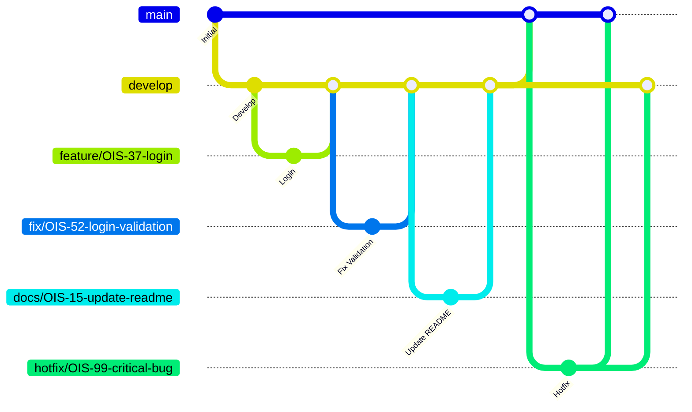

## 目次

- [1. プロジェクト概要](#1-プロジェクト概要)
  - [1.1 概要](#11-概要)
  - [1.2 利用想定](#12-利用想定)
  - [1.3 フォルダ構成](#13-フォルダ構成)
- [2. 環境構築手順](#2-環境構築手順)
  - [2.1 リポジトリをクローン](#21-リポジトリをクローン)
  - [2.2 パッケージインストール](#22-パッケージインストール)
    - [2.2.0 Yarnインストール](#220-yarnインストール)
    - [2.2.1 ライブラリの一括インストール](#221-ライブラリの一括インストール)
  - [2.3 環境変数](#23-環境変数)
  - [2.4 開発サーバー起動（フロントエンド起動）](#24-開発サーバー起動フロントエンド起動)
  - [2.5 動作確認](#25-動作確認)
- [3. ESLintとPrettierの使用方法](#3-eslintとprettierの使用方法)
  - [3.1 CLIから実行する](#31-cliから実行する)
    - [3.1.1 Linterを実行する](#311-linterを実行する)
    - [3.1.2 Formatterのチェックを実行する](#312-formatterのチェックを実行する)
  - [3.2 VSCodeで使用する](#32-vscodeで使用する)
  - [3.3 エラーを修正する](#33-エラーを修正する)
    - [3.3.1 Lintエラーを修正する](#331-lintエラーを修正する)
    - [3.3.2 Formatterのエラーを修正する（自動整形）](#332-formatterのエラーを修正する自動整形)
- [4. ブランチ運用ルール](#4-ブランチ運用ルール)
  - [4.1 ブランチの概要](#41-ブランチの概要)
    - [4.1.1 ブランチ構成](#411-ブランチ構成)
    - [4.1.2 ブランチの切り方](#412-ブランチの切り方)
  - [4.2 マージ・被マージの流れ](#42-ブランチの切り方マージ被マージの流れ)
    - [4.2.1 マージ、被マージの流れの図](#421-マージ被マージの流れの図)
    - [4.2.2 基本ルール](#422-基本ルール)
    - [4.2.3 禁止事項](#423-禁止事項)
    - [4.2.4 例外ルール](#424-例外ルール)
  - [4.3 タスクに対する使用の仕方](#43-タスクに対する使用の仕方)
    - [4.3.1 使用の仕方](#431-使用の仕方)
    - [4.3.2 コミットメッセージ Prefix](#432-コミットメッセージ-prefix)
  - [4.4 ブランチ命名規則](#44-ブランチ命名規則)

## 1. プロジェクト概要

### 1.1 概要

社内ヘルプデスク管理システムのバックエンドAPI。
FastAPIを用いたRESTful APIサーバーとして、問い合わせの受付・管理・回答機能を提供する。

&nbsp;

### 1.2 利用想定

社内新人教育プログラムの一環として開発するヘルプデスクサービスのバックエンド。
社員からの問い合わせ(チケット)を受け付け、担当者がシステム上で対応・管理することを想定している。

【社員】

- システム管理者が作成した登録済みアカウントでログインする
- 質問日・公開設定・要件・詳細を入力してチケットを新規作成する
- 自身が作成したチケット、および他の社員が作成した公開設定が「公開」のチケットを閲覧する
- サポート担当とのやりとりを通じて問い合わせ内容の解決を図る

【サポート担当】

- システム管理者が作成した登録済みアカウントでログインする
- 全チケットを一覧で閲覧する
- チケットをアサインして担当者として割り当てる
- チケットのステータスを更新し、社員との質疑応答を通じて対応する

【システム管理者】

- システム上で作成したアカウントでログインし、ユーザーおよびチケットの管理・運用を担う
- ユーザーの登録・削除によりアカウントを管理する
- 全チケットの閲覧・ステータス更新・アサイン変更を行う
- チケットのステータスに応じた積み上げグラフで消費チケット数を把握する

&nbsp;

### 1.3 フォルダ構成

**<フォルダ構成の設計方針>**

- 各フォルダは固有の役割を持ち、責務が明確に分離されている。
- フォルダ・ファイルの役割を超えた処理は記述しないこと。また、1つのフォルダ・ファイルが複数の責務を持たないことをルールとする。
- 役割に迷った場合は、下記のフォルダ説明を参照し、適切な場所に実装すること。
- 再利用可能なUIコンポーネント（`components/`配下）は、Atomic Designの考え方をベースに `atoms/` `organisms/` `templates/` へフォルダを分けて管理する。
- `components/ui/`配下はChakra UIによって自動生成されたコンポーネントを置く場所のため、ファイルの追加・削除は行わないこと。

&nbsp;

```
helpdesk-FE/
├── src/
│   ├── main.tsx                  # アプリケーションのエントリーポイント。ReactDOMでAppをマウントする
│   ├── App.tsx                   # アプリ全体のルートとなるコンポーネント
│   ├── core/                     # アプリ実行前の前処理（環境変数の検証・設定値の定義など）を置く場所
│   │   └── config.ts             # 環境変数（.env）を検証し、アプリ全体で使う設定値を定義する
│   ├── components/               # 再利用可能なUIコンポーネントを置く場所（Atomic Designの考え方をベースに分類）
│   │   ├── atoms/                # これ以上分割できない最小単位のUIパーツを置く場所
│   │   ├── molecules/            # atomsを組み合わせた、小さな機能単位のUIパーツを置く場所
│   │   ├── organisms/            # atoms・moleculesを組み合わせた、特定の役割・意味を持つUIブロックを置く場所
│   │   │   └── Header.tsx        # 画面共通のヘッダー
│   │   ├── templates/            # ページ全体のレイアウト（枠組み）を定義する場所
│   │   │   └── BaseLayout.tsx    # 共通レイアウト。Header・ページ固有コンテンツ・Toasterの配置を担う
│   │   ├── pages/                # ルーティングに紐づく、各画面単位のコンポーネントを置く場所
│   │   └── ui/                   # Chakra UIによる自動生成コンポーネント（color-mode, provider, toaster, tooltip等）※追加・削除禁止
│   ├── features/                 # 機能（画面・ドメイン）単位のコンポーネント・ロジックをまとめる場所
│   ├── services/                 # APIとの通信処理をまとめる場所
│   │   ├── base/                 # 通信処理の共通基盤（axiosインスタンスの生成等）を置く場所
│   │   └── internal/             # 自社バックエンド（helpdesk-BE）のAPIとの通信処理を置く場所
│   ├── share/                    # 複数のfeatureをまたいで共通利用するロジック・コンポーネント等を置く場所
│   │   ├── constants/            # 複数箇所で使用する定数を置く場所
│   │   ├── logic/                # 複数箇所で使用する共通ロジック（関数）を置く場所
│   │   │   ├── sample.ts         # 共通ロジックのサンプル実装
│   │   │   └── __test__/
│   │   │       └── sample.test.ts # sample.tsのテストコード
│   │   └── types/                # 複数箇所で使用する型定義を置く場所
│   ├── routes/                   # ルーティング定義を置く場所
│   │   └── router.tsx            # react-router-domによるアプリ全体のルーティング設定
│   └── tests/                    # テスト実行に関する共通設定・ユーティリティを置く場所
│       ├── setup.ts              # テスト実行前のグローバルセットアップ処理
│       ├── config/                # テスト実行時の設定ファイルを置く場所
│       │   └── testQueryClient.ts # テスト用のQueryClientを生成する設定
│       ├── providers/             # テストで使用する共通のProviderコンポーネントを置く場所
│       │   └── customRenderProvider.tsx # テスト用にコンポーネントをラップする共通Provider
│       └── helper/                # テストで使用する共通のヘルパー関数を置く場所
│           ├── customRender.tsx  # 共通Providerでラップしたrender関数
│           └── customRenderHook.tsx # 共通Providerでラップしたrender Hook関数
├── public/                       # ビルド時にそのまま配信される静的ファイル（現状ファイルなし）
├── .github/                      # GitHub設定
│   ├── workflows/
│   │   └── ci.yml                # GitHub ActionsによるCI設定（Lint・Format・単体テストの自動実行）
│   └── pull_request_template.md  # PR作成時のテンプレート
├── .vscode/                      # VSCodeのワークスペース設定
│   └── settings.json             # 保存時のフォーマット等、エディタ共通設定
├── index.html                    # アプリのHTMLエントリーポイント
├── vite.config.ts                # Viteのビルド・開発サーバー設定
├── tsconfig.json                 # TypeScript設定（プロジェクト全体の参照をまとめる）
├── tsconfig.app.json             # TypeScript設定（アプリ用ソースコード向け）
├── tsconfig.node.json            # TypeScript設定（Vite等Node実行環境向け）
├── eslint.config.js              # ESLintの設定
├── .prettierrc                   # Prettierの設定
├── .gitignore                    # Gitの追跡除外設定
├── package.json                  # プロジェクト設定・依存関係定義
├── yarn.lock                     # 依存関係のバージョン固定ファイル
├── .env                          # 環境変数ファイル（開発環境用）
├── .env.ci                       # 環境変数ファイル（CI実行時の単体テスト用）
├── .env.example                  # 環境変数のサンプルファイル
└── README.md
```

&nbsp;

**<テストファイルの配置ルール>**

- テスト対象のファイルと同じ階層に `__test__` フォルダを作成する
- `__test__` フォルダ配下に、`テスト対象ファイル名.test.tsx`（`.ts`ファイルが対象の場合は `.test.ts`）というファイル名でテストファイルを作成する
- そのテストファイルの中に、対象ファイルに対するテストコードを記述する

例（`src/logic/formatDate.ts` のテストを作成する場合）

```
src/share/logic/
├── formatDate.ts
└── __test__/
    └── formatDate.test.ts
```

&nbsp;

## 2. 環境構築手順

### 動作環境

- Node.js 26.4.0（2026-06-30現在最新バージョン）
- Yarn 1.22.22

---

&nbsp;

### 2.1 リポジトリをクローン

階層構成は、helpdeskフォルダ配下にhelpdesk-BEとhelpdesk-FEがある想定。

自身の環境にクローン先のフォルダの用意をし、用意したフォルダ配下でコマンドを実行する。

&nbsp;

```bash
git clone git@github.com:OzasaHitomi/helpdesk-FE.git
```

&nbsp;
---

&nbsp;

### 2.2 パッケージインストール

#### 2.2.0 Yarnインストール

- Yarnインストール
  - 自身の環境にyarnが入っていない場合、インストールする
  - 自身の環境にyarnが入っている場合、2.2.0の工程は不要
- 事前に自身の環境にyarnが入っているか確認する

```bash
npm list -g --depth=0
```

- `npm list -g --depth=0`コマンド実行結果にyarnが表示されない場合、npmからyarnをグローバルにインストールする

```bash
npm install -g yarn
```

- インストール後、バージョンが表示されることを確認する

```bash
yarn -v
```

&nbsp;

#### 2.2.1 ライブラリの一括インストール

- yarn.lock（依存関係が固定されたファイル）から、その正確なバージョンに従って、Node.jsプロジェクトにおける必要なライブラリの一括インストールを行う
- コマンドを実行するには、package.jsonファイルがあるプロジェクトフォルダ（`helpdesk-FE`）配下でコマンドを実行する必要がある

```bash
yarn install
```

&nbsp;
---

&nbsp;

### 2.3 環境変数

`.env.example` を参考に、以下のファイルをルートディレクトリに作成し必要な値を設定する。

- .env ファイル（開発環境設定）
- .env.e2e ファイル（テスト環境設定）

Viteの仕様上、`VITE_`から始まる環境変数のみがブラウザ側に公開されるため、命名時は必ず`VITE_`プレフィックスを付与すること。

※ FEはBEのAPIと通信するため、事前に`helpdesk-BE`を起動しておくこと（`helpdesk-BE`のREADME参照）。

&nbsp;

---

&nbsp;

### 2.4 開発サーバー起動（フロントエンド起動）

コマンドを実行するには、package.jsonファイルがあるルートフォルダ配下でコマンドを実行する。

- 開発サーバー起動

```bash
yarn dev
```

<!-- * 本番用ビルド
```bash
yarn build
```
* ビルド成果物のプレビュー
```bash
yarn preview
``` -->

- Lint実行

```bash
yarn lint
```

&nbsp;
---

&nbsp;

### 2.5 動作確認

ブラウザでURLを入力し、遷移先で画面が表示されれば、正常に起動している。

- 開発環境

```
http://localhost:5173
```

&nbsp;

&nbsp;

## 3. ESLintとPrettierの使用方法

ESLintは、コードの静的解析（Linter）を行うツールです。
Prettierは、コード整形（Formatter）を行うツールです。

本プロジェクトでは、CLIからの実行と、VSCodeでの自動実行の両方に対応しています。

&nbsp;

### 3.1 CLIから実行する

コマンドを実行するには、package.jsonファイルがあるプロジェクトルート（`helpdesk-FE`）配下でコマンドを実行する。

&nbsp;

#### 3.1.1 Linterを実行する

コードの構文エラーや未使用のimport、コーディング規約違反などをチェックする。

```bash
yarn lint
```

&nbsp;

#### 3.1.2 Formatterのチェックを実行する

コードがPrettierのフォーマットルールに従っているかをチェックする（ファイルの内容は変更されない）。

```bash
yarn format
```

&nbsp;

### 3.2 VSCodeで使用する

VSCodeでは、保存時にPrettierによるコード整形を自動で行う。

以下の拡張機能をインストールしておく。

- ESLint（Microsoft）
- Prettier - Code formatter（esbenp）

保存時の動作

- Prettierのフォーマットルールに従ってコードを自動整形する

※ ESLintによるLintエラーの自動修正は保存時には行われないため、[3.3.1](#331-lintエラーを修正する)の手順で修正すること。

※ `.vscode/settings.json` に設定が含まれているため、拡張機能をインストールすれば追加設定は不要。

&nbsp;

### 3.3 エラーを修正する

#### 3.3.1 Lintエラーを修正する

`yarn lint` を実行してエラーが表示された場合は、内容を確認して修正する。

自動修正可能な項目については、`yarn lint:fix` を実行することで修正される。

&nbsp;

#### 3.3.2 Formatterのエラーを修正する（自動整形）

コードをプロジェクトのフォーマットルールに従って自動整形する。

```bash
yarn format:fix
```

&nbsp;

## 4. ブランチ運用ルール

### 4.1 ブランチの概要

#### 4.1.1 ブランチ構成

```
main
├── develop
│   ├── feature/xxx
│   ├── fix/xxx
│   └── docs/xxx
└── hotfix/xxx
```

&nbsp;

| ブランチ名    | 役割                                                                                                    |
| ------------- | ------------------------------------------------------------------------------------------------------- |
| `main`        | 本番環境に反映される安定したコード                                                                      |
| `develop`     | 開発の統合ブランチ。`feature` / `fix` / `docs` ブランチの変更をまとめ、リリース時に `main` にマージする |
| `feature/xxx` | 新機能の開発。完成したら `develop` にマージ                                                             |
| `fix/xxx`     | バグ修正。完成したら `develop` にマージ                                                                 |
| `docs/xxx`    | ドキュメントの追加・修正。完成したら `develop` にマージ                                                 |
| `hotfix/xxx`  | 本番障害の緊急対応。`main` から派生し、`main` と `develop` 両方にマージ                                 |

&nbsp;

<docsブランチで扱うドキュメント>

- README

<!-- * API仕様
* DB設計
* 認証仕様 -->

&nbsp;

<fixブランチとhotfixブランチの違い>

- fixブランチ → 緊急を要さないコードの修正をする場合
- hotfixブランチ → 緊急で修正が必要な場合

&nbsp;

#### 4.1.2 ブランチの切り方

作業ブランチは以下の手順で作成する。

&nbsp;

**① リモートの最新状態を取得する**

```bash
git fetch origin
```

&nbsp;

**② 起点となるブランチに切り替え、最新の状態にする**

通常の開発ブランチ（feature, fix, docs）は `develop` から作成する。
起点となる`develop` ブランチに切り替え、最新の状態にする

```bash
git checkout develop
git pull origin develop
```

緊急修正ブランチ（hotfix）は `main` から作成する。
起点となる`main` ブランチに切り替え、最新の状態にする

```bash
git checkout main
git pull origin main
```

&nbsp;

**③ 新しいブランチを作成して切り替える**

通常の開発ブランチ(featureブランチを切った場合)

```bash
git checkout -b feature/OIS-8-login-page
```

緊急修正ブランチ

```bash
git checkout -b hotfix/OIS-99-critical-bug
```

&nbsp;

### 4.2 マージ・被マージの流れ

#### 4.2.1 マージ、被マージの流れの図



&nbsp;

#### 4.2.2 基本ルール

<通常開発時>

- `feature/*`、 `fix/*`、`docs/*` ブランチは、必ず `develop` ブランチから作成する。
- 機能開発(`feature/*`ブランチ)・バグ修正(`fix/*`ブランチ)・ドキュメント修正(`docs/*` ブランチ)が完了したら、Pull Request を作成し `develop` ブランチへマージする。
- `develop`ブランチには、レビューおよび各種 CI が成功した変更のみをマージする。
- リリース時は `develop`ブランチを `main` ブランチへマージする。
  &nbsp;

<緊急修正時>

- 本番環境の重大な不具合については、通常の開発フローよりも迅速な復旧を優先し、`hotfix/*` ブランチを用いて対応する。
- 緊急対応が必要な場合は `main` ブランチから `hotfix/*` ブランチを作成して修正を行う。
- `hotfix/*` ブランチは、修正完了後に `main` と `develop` の両方へマージし、修正内容の差分が発生しないようにする。
- 緊急修正時のマージは機能開発と同様に、レビューおよび各種 CI が成功した変更のみを、`main` ブランチと`develop`ブランチにマージする。
- 例外対応を行った場合でも、修正内容は `main` と `develop` の両方へ反映し、ブランチ間の差分が残らないようにする。
  &nbsp;

<共通ルール>

- `feature/*`、`fix/*`、`docs/*`、`hotfix/*` などの作業ブランチへの直接 Push は問題ないが、`main` / `develop` へのマージは必ず Pull Request を経由して行う。

&nbsp;

#### 4.2.3 禁止事項

- `feature/` → `main` への直接マージ
- `fix/*` → `main` への直接マージ
- `docs/*` → `main` への直接マージ
- `feature/*` 同士、`fix/*` 同士、`docs/*` 同士のマージ
- `feature/*`・`fix/*`・`docs/*` 同士のマージ
  - `develop` 配下のブランチは `develop` にのみマージすること
- `develop`・`main` への直接 Push
- レビューが完了していない Pull Request のマージ
- Pull Request を作成した本人によるセルフマージ

&nbsp;

#### 4.2.4 例外ルール

基本ルールを適用できない状況が発生した場合は、独断で対応せず、チーム内で対応方針を決定する。

&nbsp;

### 4.3 タスクに対する使用の仕方

#### 4.3.1 使用の仕方

- Jiraの1つのタスクにつき1つのブランチを作成し、複数のタスクを1つのブランチで作業しない。
- コミットメッセージは、「prefix(type): 変更点の内容」で記述(prefixについては4.3.2に詳細有り)
- PRタイトルはJiraのタスク名

例

```
Jira → OIS-42 ブランチ運用ルールの制定
branch → feature/OIS-42-branch-rule
commit message → fix: マーメイド図の修正
PR title → [OIS-42] ブランチ運用ルールの制定
```

&nbsp;

#### 4.3.2 コミットメッセージ Prefix

Conventional Commits 規約

| type       | 用途                                                       |
| ---------- | ---------------------------------------------------------- |
| `feat`     | 新機能の追加                                               |
| `fix`      | バグ修正                                                   |
| `docs`     | ドキュメントのみの変更                                     |
| `style`    | コードの動作に影響しない変更（フォーマット、セミコロン等） |
| `refactor` | バグ修正でも機能追加でもないコードの変更                   |
| `test`     | テストの追加・修正                                         |
| `chore`    | ビルドプロセスや補助ツールの変更（package.jsonの更新等）   |
| `perf`     | パフォーマンス改善                                         |
| `ci`       | CI設定ファイルの変更                                       |
| `revert`   | 以前のコミットの取り消し                                   |

&nbsp;

### 4.4 ブランチ命名規則

```
種別/タスク番号-内容
```

- タスク内容は、担当者が内容を適切に表現した英語で命名する。
- タスク内容には英小文字のみを使用する。
- 複数の単語で構成する場合は、単語の区切りに -（ハイフン）を使用する。

例

```
feature/OIS-8-login-page
fix/OIS-17-validation-error
docs/OIS-45-readme-update
hotfix/OIS-OIS-99-critical-bug
```

&nbsp;
