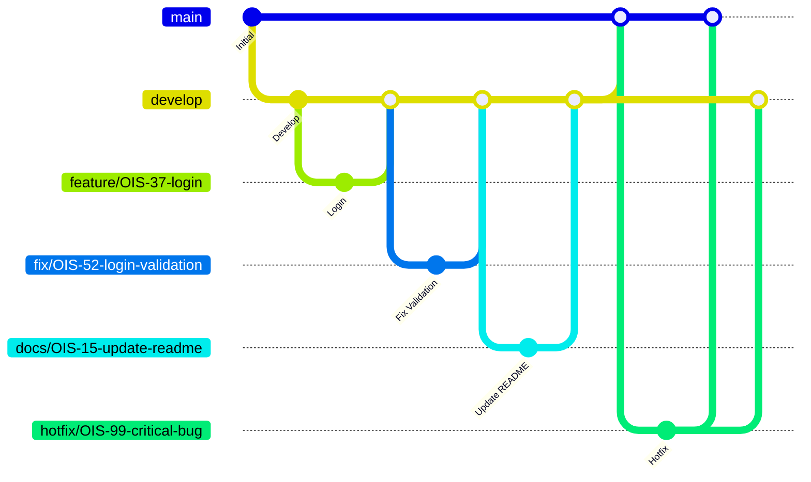

## 目次
- [1. ブランチ運用ルール](#1-ブランチ運用ルール)
  - [1.1 ブランチの概要](#11-ブランチの概要)
    - [1.1.1 ブランチ構成](#111-ブランチ構成)
    - [1.1.2 ブランチの切り方](#112-ブランチの切り方)
  - [1.2 マージ・被マージの流れ](#12-ブランチの切り方マージ被マージの流れ)
    - [1.2.1 マージ、被マージの流れの図](#121-マージ被マージの流れの図)
    - [1.2.2 基本ルール](#122-基本ルール)
    - [1.2.3 禁止事項](#123-禁止事項)
    - [1.2.4 例外ルール](#124-例外ルール)
  - [1.3 タスクに対する使用の仕方](#13-タスクに対する使用の仕方)
    - [1.3.1 使用の仕方](#131-使用の仕方)
    - [1.3.2 コミットメッセージ Prefix](#132-コミットメッセージ-prefix)
  - [1.4 ブランチ命名規則](#14-ブランチ命名規則)
- [2. 環境構築手順](#2-環境構築手順)


## 1. ブランチ運用ルール

### 1.1 ブランチの概要
#### 1.1.1 ブランチ構成

```
main
├── develop
│   ├── feature/xxx
│   ├── fix/xxx
│   └── docs/xxx
└── hotfix/xxx
```
&nbsp;  

| ブランチ名 | 役割 |
|---|---|
| `main` | 本番環境に反映される安定したコード |
| `develop` | 開発の統合ブランチ。`feature` / `fix` / `docs` ブランチの変更をまとめ、リリース時に `main` にマージする |
| `feature/xxx` | 新機能の開発。完成したら `develop` にマージ |
| `fix/xxx` | バグ修正。完成したら `develop` にマージ |
| `docs/xxx` | ドキュメントの追加・修正。完成したら `develop` にマージ |
| `hotfix/xxx` | 本番障害の緊急対応。`main` から派生し、`main` と `develop` 両方にマージ |


&nbsp; 

<docsブランチで扱うドキュメント>
* README
<!-- * API仕様
* DB設計
* 認証仕様 -->

&nbsp; 

<fixブランチとhotfixブランチの違い>
* fixブランチ → 緊急を要さないコードの修正をする場合
* hotfixブランチ → 緊急で修正が必要な場合

&nbsp;  

#### 1.1.2 ブランチの切り方

作業ブランチは以下の手順で作成する。

&nbsp; 

**① リモートの最新状態を取得する**
```bash
git fetch origin
```
&nbsp; 

**② 起点となるブランチに切り替え、最新の状態にする**

通常の開発ブランチ（feature, fix, docs）は `develop` から作成する。
起点となる`develop` ブランチに切り替え、最新の状態にする
```bash
git checkout develop
git pull origin develop
```

緊急修正ブランチ（hotfix）は `main` から作成する。
起点となる`main` ブランチに切り替え、最新の状態にする
```bash
git checkout main
git pull origin main
```
&nbsp; 

**③ 新しいブランチを作成して切り替える**

通常の開発ブランチ(featureブランチを切った場合)
```bash
git checkout -b feature/OIS-8-login-page
```
緊急修正ブランチ
```bash
git checkout -b hotfix/OIS-99-critical-bug
```

&nbsp;  


### 1.2 マージ・被マージの流れ


#### 1.2.1 マージ、被マージの流れの図

&nbsp;  

#### 1.2.2 基本ルール
<通常開発時>
* `feature/*`、 `fix/*`、`docs/*` ブランチは、必ず `develop`  ブランチから作成する。
* 機能開発(`feature/*`ブランチ)・バグ修正(`fix/*`ブランチ)・ドキュメント修正(`docs/*` ブランチ)が完了したら、Pull Request を作成し `develop` ブランチへマージする。
* `develop`ブランチには、レビューおよび各種 CI が成功した変更のみをマージする。
* リリース時は `develop`ブランチを `main` ブランチへマージする。
&nbsp;  

<緊急修正時>
* 本番環境の重大な不具合については、通常の開発フローよりも迅速な復旧を優先し、`hotfix/*` ブランチを用いて対応する。
* 緊急対応が必要な場合は `main` ブランチから `hotfix/*` ブランチを作成して修正を行う。
* `hotfix/*` ブランチは、修正完了後に `main` と `develop`  の両方へマージし、修正内容の差分が発生しないようにする。
* 緊急修正時のマージは機能開発と同様に、レビューおよび各種 CI が成功した変更のみを、`main` ブランチと`develop`ブランチにマージする。
* 例外対応を行った場合でも、修正内容は `main` と `develop` の両方へ反映し、ブランチ間の差分が残らないようにする。
&nbsp;  

<共通ルール>
* `feature/*`、`fix/*`、`docs/*`、`hotfix/*` などの作業ブランチへの直接 Push は問題ないが、`main` / `develop` へのマージは必ず Pull Request を経由して行う。


&nbsp;  

#### 1.2.3 禁止事項
* `feature/` → `main` への直接マージ
* `fix/*` → `main` への直接マージ
* `docs/*` → `main` への直接マージ
* `feature/*` 同士、`fix/*` 同士、`docs/*` 同士のマージ
* `feature/*`・`fix/*`・`docs/*` 同士のマージ
  * `develop` 配下のブランチは `develop` にのみマージすること
* `develop`・`main` への直接 Push
* レビューが完了していない Pull Request のマージ
* Pull Request を作成した本人によるセルフマージ

&nbsp;  

#### 1.2.4 例外ルール

基本ルールを適用できない状況が発生した場合は、独断で対応せず、チーム内で対応方針を決定する。

&nbsp;  

### 1.3 タスクに対する使用の仕方

#### 1.3.1 使用の仕方
* Jiraの1つのタスクにつき1つのブランチを作成し、複数のタスクを1つのブランチで作業しない。
* コミットメッセージは、「prefix(type): 変更点の内容」で記述(prefixについては1.3.2に詳細有り)
* PRタイトルはJiraのタスク名

例

```
Jira → OIS-42 ブランチ運用ルールの制定
branch → feature/OIS-42-branch-rule
commit message → fix: マーメイド図の修正
PR title → [OIS-42] ブランチ運用ルールの制定
```
&nbsp;  

#### 1.3.2 コミットメッセージ Prefix
Conventional Commits 規約

|type|用途|
|---|---|
|`feat`|新機能の追加|
|`fix`|バグ修正|
|`docs`|ドキュメントのみの変更|
|`style`|コードの動作に影響しない変更（フォーマット、セミコロン等）|
|`refactor`|バグ修正でも機能追加でもないコードの変更|
|`test`|テストの追加・修正|
|`chore`|ビルドプロセスや補助ツールの変更（package.jsonの更新等）|
|`perf`|パフォーマンス改善|
|`ci`|CI設定ファイルの変更|
|`revert`|以前のコミットの取り消し|

&nbsp;  

### 1.4 ブランチ命名規則

```
種別/タスク番号-内容
```
* タスク内容は、担当者が内容を適切に表現した英語で命名する。
* タスク内容には英小文字のみを使用する。
* 複数の単語で構成する場合は、単語の区切りに -（ハイフン）を使用する。

例

```
feature/OIS-8-login-page
fix/OIS-17-validation-error
docs/OIS-45-readme-update
hotfix/OIS-OIS-99-critical-bug
```

&nbsp;  


## 2. 環境構築手順
